  

  
  
  

  <strong>Software Engineer · Applied AI · M.S. Computer Science, Arizona State University (2026)</strong>

I build reliable software and AI-powered products around real human needs. My work spans retrieval systems, conversational interfaces, accessible technology, and full-stack web applications—from helping seniors navigate government benefits to creating tools for visually impaired students.

Currently seeking full-time **Software Engineer** and **AI Engineer** opportunities.

## Impact at a glance

<table>
  <tr>
    <td align="center"><strong>90%</strong> retrieval precision in a custom RAG evaluation</td>
    <td align="center"><strong>700+</strong> students mentored across five teaching roles</td>
    <td align="center"><strong>280+</strong> member community built from the ground up</td>
    <td align="center"><strong>$1.8K</strong> funding secured through technical leadership</td>
  </tr>
</table>

## Selected engineering work

### Board Game Rules RAG Engine
**Python · Retrieval-Augmented Generation · Gradio**

Built a source-grounded retrieval system that answers complex rules questions with citations. Designed structure-aware chunking, an insufficient-context fallback, and a custom evaluation harness that achieved **90% retrieval precision**.

[View repository →](https://github.com/Gourav-praneeth/Board-Game-Rule-Assistant)

### Government Financial Aid Assistant
**React · Firebase · Vercel**

Developed a conversational web experience during an AI Software Engineer externship at **Beam Group**, helping Canadian seniors understand and navigate CPP applications. Focused on accessible interaction, real-time authentication, and scalable deployment.

### Accessible 3D Campus Map
**Human-centered design · CAD · Accessibility**

Co-designed a tactile map of ASU's Tempe campus with visually impaired students. Combined raised paths, braille, and spatial landmarks to support more independent campus navigation.

  <a href="https://gourav-praneeth.github.io"><strong>Explore more projects and case studies →</strong></a>

## Technical toolkit

**Languages**

**AI engineering**

**Product development**

## Beyond the code

- **Educator:** Mentored 700+ students in Python, C++, and mathematics across five teaching roles.
- **Community builder:** Founded and led ASU's Board Games Club from zero to 280+ members.
- **Continuous learner:** Completed applied AI programs from OpenAI, Hugging Face, Anthropic, and Microsoft.

## GitHub activity

<!-- Generated daily by .github/workflows/profile-summary-cards.yml. -->

  

  
  

---

  <strong>Build with purpose. Measure what matters. Keep improving.</strong> 
  Open to full-time opportunities and thoughtful collaborations.

